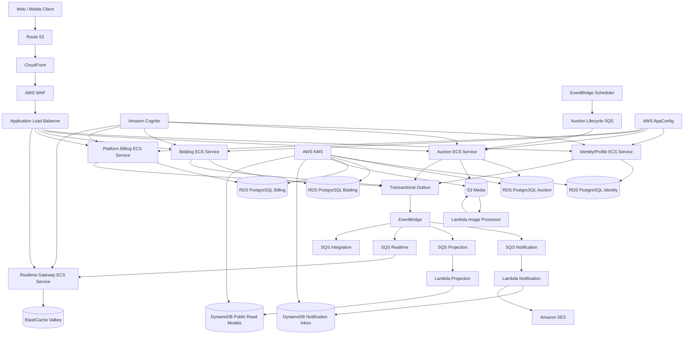

# Auction Platform — Final Production Architecture Blueprint and Roadmap

**Status:** Revised production blueprint  
**Architecture intent:** Senior Java + AWS portfolio / production-grade reference architecture  
**Primary principle:** Java/Spring Boot owns business complexity; AWS owns infrastructure/platform complexity  
**Core stack:** Java 21 LTS, Spring Boot 3.5.x, PostgreSQL, ECS Fargate, AWS managed services  
**Deployment model:** Hybrid container + serverless  
**Target qualities:** Correctness, maintainability, scalability, security, observability, recoverability, cost discipline
**V1 domain revision (2026-10-05):** Buyer and seller settle auctioned-goods payment and delivery outside Auction ProMax. [ADR-026](adr/ADR-026-marketplace-transaction-and-monetization-boundary.md) and [ADR-027](adr/ADR-027-bidding-billing-and-listing-entitlement-ownership.md) supersede the financial-domain portions of historical ADR-005/ADR-012; historical Sprint 001 decision evidence remains unchanged. This revision does not authorize Sprint 002 activation or Phase 1 implementation.

---

# 1. Executive architecture decision

This architecture deliberately avoids becoming an "AWS service showcase".

The platform uses:

- **Spring Boot on ECS Fargate** for long-running, transaction-heavy, domain-rich services.
- **Lambda** for short-lived, event-driven, bursty supporting workloads.
- **PostgreSQL** as the canonical source of truth for each service's relational business state.
- **DynamoDB** only for access-pattern-specific projections, inboxes and TTL-heavy records.
- **EventBridge + SQS** for asynchronous integration and consumer isolation.
- **Step Functions** only for long-running orchestration where explicit workflow state, retries or callbacks are valuable.
- **Managed AWS security, observability, CI/CD, backup and governance services** around the application.

The architecture is optimized to demonstrate both:

1. senior-level Java/backend engineering; and
2. production-grade AWS architecture and platform engineering.

V1 is a marketplace for seller auctions and buyer bids. The platform finalizes the winner and provides an authorized handoff; buyer and seller arrange payment and delivery outside the platform. Revenue comes from advertising and paid, non-monetary listing entitlements. The platform does not take transaction commission or handle auction-item payment, escrow, seller payout, stored monetary wallets, deposits, withdrawals, financial holds/settlement or platform-controlled delivery. Adding any of these requires a new decision and legal/compliance review.

---

# 2. Engineering principles

| ID   | Principle                                                                                           |
| ---- | --------------------------------------------------------------------------------------------------- |
| P-01 | Business invariants remain inside the owning Java bounded context.                                  |
| P-02 | Data that must change atomically stays in one local PostgreSQL transaction.                         |
| P-03 | AWS services must not fragment a domain transaction without a measured reason.                      |
| P-04 | Lambda is used for asynchronous/supporting workloads, not as a default replacement for Spring Boot. |
| P-05 | One service owns each invariant and its canonical data.                                             |
| P-06 | No service reads or writes another service's database.                                              |
| P-07 | Integration delivery is at-least-once; every consumer is idempotent.                                |
| P-08 | Database write and event publication use transactional outbox.                                      |
| P-09 | Valkey, DynamoDB projections, OpenSearch and caches are never canonical bid, result or entitlement truth. |
| P-10 | External bid, publication, close and platform-purchase commands have idempotency keys.              |
| P-11 | Public APIs and integration events support N/N-1 compatibility during rolling deployment.           |
| P-12 | Services scale independently only when evidence shows they need to.                                 |
| P-13 | Production security, backup, observability and audit are first-class architecture concerns.         |
| P-14 | Infrastructure complexity is introduced in phases with explicit exit gates.                         |
| P-15 | Every expensive or operationally heavy service requires a trigger and rollback path.                |

---

# 3. Target competency model

The project should intentionally exercise the following skill mix:

| Area                            | Target depth |
| ------------------------------- | -----------: |
| Java/JVM                        |          20% |
| Spring ecosystem                |          20% |
| PostgreSQL/database engineering |          15% |
| Distributed systems             |          15% |
| AWS architecture                |          20% |
| DevOps/SRE/security             |          10% |

The desired outcome is not "used many AWS services".

The desired outcome is:

> Designed and implemented a concurrent auction and non-monetary listing-entitlement platform in Java/Spring/PostgreSQL, then operated it on AWS with secure multi-account infrastructure, asynchronous integration, observability, CI/CD, backup, fault testing and evidence-based scaling.

---

# 4. Bounded-context topology

## 4.1 Core Spring Boot services

| Service | Responsibilities | Canonical data | Runtime |
| --- | --- | --- | --- |
| `identity-profile-service` | User mapping, profile, business roles, seller eligibility and account restrictions; Cognito owns credentials | PostgreSQL `identity_db` / `identity_test_db` | ECS Fargate |
| `auction-service` | Drafts, publication, lifecycle, categories, media metadata, seller ownership, final AuctionResult, free allowance and usable listing entitlements | PostgreSQL `auction_db` / `auction_test_db`; S3 media | ECS Fargate |
| `bidding-service` | Bid placement/history, current price/winner, bidding session, idempotency, concurrency, minimum increment and final bid consistency | PostgreSQL `bidding_db` / `bidding_test_db` | ECS Fargate |
| `billing-service` | Purchases of Auction ProMax listing packages, PurchaseOrder, licensed PSP adapter, signed webhooks, replay protection and provider reconciliation | PostgreSQL `billing_db` / `billing_test_db` | ECS Fargate |
| `realtime-gateway` | WebSocket authentication, subscriptions, fanout and reconnect/snapshot support | No PostgreSQL; ephemeral Valkey state only | ECS Fargate |

`auction-service` decides whether the seller can publish. Entitlement consumption and auction publication must commit in one local `auction_db` transaction; this is not a synchronous authorization call to billing. `billing-service` proves payment for the platform's own listing service and emits an integration signal for entitlement grant. Listing entitlements are non-monetary, non-withdrawable, non-transferable, and cannot buy auction goods or represent seller payout/stored value. Advertising begins later through a lightweight third-party network/client integration; a dedicated advertising backend requires traffic/revenue evidence, not Phase 0 provisioning.

## 4.2 Serverless supporting workloads

| Workload                     | Runtime      | Why                                       |
| ---------------------------- | ------------ | ----------------------------------------- |
| Notification consumer        | Lambda       | Event-driven, stateless, bursty           |
| Public projection builder    | Lambda       | Event → DynamoDB projection               |
| Image processor              | Lambda       | S3-triggered validation/resize/thumbnail  |
| Email dispatcher             | Lambda + SES | Short asynchronous delivery workload      |
| Lightweight operational jobs | Lambda       | Scheduled/short-lived automation          |
| Selected DLQ automation      | Lambda       | Operational support, not domain authority |

## 4.3 Optional later services

| Capability                   | Add only when                                                                              |
| ---------------------------- | ------------------------------------------------------------------------------------------ |
| OpenSearch                   | PostgreSQL search misses agreed latency/relevance/faceting SLOs                            |
| MSK                          | Replay, ordered partition processing or sustained throughput exceeds EventBridge/SQS model |
| Kinesis                      | Streaming analytics has a real product/operations requirement                              |
| Dedicated analytics platform | Historical data volume/query demand justifies it                                           |
| EKS                          | Organization has a real Kubernetes platform requirement, not for learning alone            |

---

# 5. Why Bidding Core stays in Java/Spring Boot

`bidding-service` intentionally owns the complete consistency boundary for bid placement:

1. Claim/read idempotency record.
2. Lock/read canonical bidding-session state.
3. Verify the auction accepts bids through a versioned eligibility/lifecycle contract.
4. Validate bidder eligibility.
5. Calculate minimum acceptable bid.
6. Validate bid amount.
7. Update previous winner state where applicable.
8. Insert accepted bid.
9. Update canonical winner/current price and increment aggregate version.
10. Write integration event to outbox.
11. Store idempotent response.
12. Commit exactly once.

This flow must remain one local business transaction.

Auction owns lifecycle and Bidding owns bid acceptance. Phase 4 proves the Bidding-local closed-session race; Phase 5 defines a versioned close/fencing contract: Auction requests close, Bidding durably fences the session against new accepted bids and returns the final bid/version, then Auction records the final AuctionResult. Retries and out-of-order messages must not reopen a fenced session or finalize from an unfenced snapshot. This is a later product protocol, not Phase 0 implementation.

It must **not** be decomposed into a chain of Lambda functions or distributed service calls just to become "more serverless".

### Required Java/database topics exercised here

- Spring transaction management
- JPA/Hibernate internals
- JDBC and HikariCP
- PostgreSQL locking
- `SERIALIZABLE` isolation
- optimistic/pessimistic locking
- advisory locks where justified
- deadlock handling
- serialization retry
- unique constraints
- idempotency
- monotonic aggregate version and close-vs-bid race design
- concurrency testing
- virtual threads
- JVM profiling
- Testcontainers
- property-based testing

---

# 6. Final AWS production topology



---

# 7. AWS service responsibility matrix

## 7.1 Runtime/core production services

| AWS service            | Role                                 | Required?      |
| ---------------------- | ------------------------------------ | -------------- |
| Route 53               | DNS                                  | Yes            |
| CloudFront             | CDN/edge                             | Yes            |
| AWS WAF                | Edge protection and rate-based rules | Yes            |
| ALB                    | HTTP/WebSocket ingress and routing   | Yes            |
| ECS                    | Container orchestration              | Yes            |
| Fargate                | Serverless container compute         | Yes            |
| Cognito                | User identity/authentication         | Yes            |
| RDS PostgreSQL         | Canonical relational data            | Yes            |
| ElastiCache for Valkey | Realtime/cache/coordination          | Yes            |
| S3                     | Images, exports, backups, data lake  | Yes            |
| EventBridge            | Integration event routing            | Yes            |
| EventBridge Scheduler  | Durable auction lifecycle scheduling | Yes            |
| SQS                    | Consumer queueing, backpressure, DLQ | Yes            |
| DynamoDB               | Notifications/read projections       | Yes            |
| Lambda                 | Supporting async workloads           | Yes, selective |
| SES                    | Email notifications                  | Recommended    |
| ACM                    | TLS certificates                     | Yes            |
| Secrets Manager        | Secrets                              | Yes            |
| KMS                    | Encryption key management            | Yes            |
| CloudWatch             | Logs, metrics, alarms                | Yes            |

## 7.2 Platform/security/operations services

| AWS service         | Role                                    | Phase               |
| ------------------- | --------------------------------------- | ------------------- |
| AppConfig           | Dynamic config and feature flags        | Early               |
| CloudTrail          | AWS API audit                           | Early               |
| AWS Config          | Drift/compliance visibility             | Early-production    |
| IAM Access Analyzer | IAM/resource policy analysis            | Early-production    |
| Inspector           | ECR/container vulnerability scanning    | Early               |
| GuardDuty           | Threat detection                        | Production          |
| Security Hub        | Security finding aggregation            | Production          |
| AWS Backup          | Centralized backups and recovery policy | Production          |
| Application Signals | APM/service maps/SLO visibility         | Early-production    |
| ECR                 | Container registry                      | Early               |
| CodeArtifact        | Maven/npm artifact repository           | Optional but useful |
| CodeBuild           | Build/test/security pipeline            | Early               |
| CodePipeline        | AWS-native delivery orchestration       | Early               |
| CodeDeploy          | ECS blue/green deployment               | Production          |
| Organizations       | Multi-account governance                | Production          |
| Control Tower       | Landing zone/governance                 | Production          |
| IAM Identity Center | Workforce access                        | Production          |
| FIS                 | Fault injection/chaos testing           | Later               |
| Resilience Hub      | Resilience assessment                   | Later               |
| Glue                | Data catalog/ETL                        | Later               |
| Athena              | Data lake queries                       | Later               |

---

# 8. Serverless usage policy

## 8.1 Use Lambda when

- workload is event-driven;
- execution is short-lived;
- state is externalized;
- bursts are expected;
- idle compute should cost little;
- independent retry is safe;
- business transaction does not span multiple atomic updates.

## 8.2 Do not use Lambda when

- persistent WebSocket connections are central;
- workload is long-running;
- connection pooling is important;
- low-latency database-heavy transactions dominate;
- complex domain behavior benefits from one Spring application boundary;
- local transaction semantics are critical;
- service is continuously active and predictable.

## 8.3 Initial Lambda functions

### `notification-consumer`

Input:

- `BidOutbid`
- `AuctionResultFinalized`
- `AuctionStarted`
- `AuctionCancelled`

Outputs:

- DynamoDB notification inbox
- SES email when enabled

### `public-projection-consumer`

Input:

- auction and bidding integration events

Output:

- DynamoDB read models

Rules:

- idempotent by event ID
- event-version aware
- projection rebuildable
- canonical state never stored only here

### `image-processor`

Trigger:

- S3 object-created event

Responsibilities:

- validate metadata
- resize image
- create thumbnails
- optional malware/content scan integration
- write processed metadata/event

---

# 9. Step Functions policy

Step Functions is **not** used for bid placement.

Use it only where explicit workflow state has value.

## Evidence-triggered candidate: platform listing-purchase reconciliation

```text
ProviderPaymentObserved
    ↓
Verify signed provider evidence
    ↓
Compare PurchaseOrder/provider state
    ↓
Retry or await provider confirmation
    ↓
Mismatch?
    ↓
Record verified outcome or alert for controlled review
```

Canonical PurchaseOrder/payment state remains in `billing_db`; usable entitlements remain in `auction_db`. Step Functions is optional only if measured long-running workflow needs justify it. It never owns a bid or entitlement-publication transaction.

## Other candidate: long-running operational recovery

```text
Start
 ↓
Collect provider purchase records
 ↓
Collect billing PurchaseOrders
 ↓
Compare
 ↓
Mismatch?
 ├─ No → Success
 └─ Yes → Alert / case / controlled resolution
```

---

# 10. Dynamic configuration and feature management

Use AWS AppConfig for runtime-controlled configuration.

Examples:

```text
billing.provider.enabled
listingPackages.enabled
newBidAlgorithm.enabled
auction.maxExtensionSeconds
auction.minimumIncrementRules
maintenanceMode
realtime.protocol.v2.enabled
fraudRules.v2.enabled
```

Requirements:

- configuration schema validation;
- deployment strategy;
- gradual rollout;
- CloudWatch alarm rollback;
- version history;
- environment-specific configuration;
- no bid, publication, entitlement or purchase invariant may depend on an unvalidated arbitrary flag.

Feature flags control rollout, not domain authorization or bid/purchase validation.

---

# 11. Data architecture

## 11.1 PostgreSQL ownership

| Database / test database | Core aggregates |
| --- | --- |
| `identity_db` / `identity_test_db` | Users, profiles, roles, seller status, restrictions, audit, idempotency, outbox/inbox |
| `auction_db` / `auction_test_db` | Categories, drafts, publication/lifecycle, media metadata, AuctionResult, free listing allowance, non-monetary entitlement grants/consumption, idempotency, outbox/inbox |
| `bidding_db` / `bidding_test_db` | BiddingSession, bids, current winner/price, final bid, idempotency, outbox/inbox |
| `billing_db` / `billing_test_db` | Listing-package catalogue, PurchaseOrder, PSP payment state, webhook receipts, reconciliation, outbox/inbox |

`realtime-gateway` owns no PostgreSQL database. Billing's purchase event is consumed idempotently to grant usable entitlements in Auction. Publication and consumption then occur atomically in `auction_db`; there is no cross-service distributed transaction or money-like entitlement balance.

Rules:

- separate users and migration histories;
- no cross-database foreign keys;
- no shared JPA entities across bounded contexts;
- no direct cross-service SQL;
- physical DB isolation may be increased when load/RPO/blast radius/compliance justify it.

## 11.2 DynamoDB approved workloads

| Workload                                    | Why                                            |
| ------------------------------------------- | ---------------------------------------------- |
| Notification inbox                          | Ordered user query, TTL, high write elasticity |
| Public auction projections                  | Predictable low-latency read patterns          |
| Optional connection metadata                | High-churn TTL records                         |
| Optional idempotent outer-workflow receipts | Conditional writes + TTL                       |

Prohibited as sole authority for:

- winning bid/current price/final result;
- listing entitlement state or publication consumption;
- platform PurchaseOrder/provider-payment state.

## 11.3 Valkey/Redis approved workloads

- WebSocket pub/sub;
- connection-to-task routing;
- short-lived auction snapshots;
- rate limits;
- public read cache;
- distributed coordination where PostgreSQL remains final correctness guard.

---

# 12. Security architecture

## 12.1 Application security

| Area           | Control                                                      |
| -------------- | ------------------------------------------------------------ |
| Authentication | Cognito User Pool/OIDC                                       |
| Admin          | MFA                                                          |
| Authorization  | Resource ownership and business roles in owning service      |
| Secrets        | Secrets Manager                                              |
| IAM            | Per-service task role, least privilege                       |
| Network        | Private application/data subnets                             |
| Edge           | CloudFront + WAF + TLS                                       |
| Platform billing | Licensed PSP adapter, signed webhooks, replay protection; no auction-item payment |
| Uploads        | Presigned URL constraints, checksum/type/size validation     |
| Logs           | Redaction of tokens, cookies, secrets and sensitive payloads |
| Audit          | Immutable audit/provenance for bids, publication and platform purchases |

## 12.2 KMS

Use customer-managed keys where operationally justified.

Encrypt:

- RDS;
- S3;
- DynamoDB;
- SQS where required;
- Secrets Manager;
- EBS;
- backup vaults.

Practice:

- key policy;
- IAM policy interaction;
- rotation;
- grants;
- encryption context;
- cross-account use;
- break-glass recovery process.

## 12.3 Cloud security services

```text
CloudTrail ───────────────► Central Log S3
Config ───────┐
GuardDuty ────┼───────────► Security Hub
Inspector ────┤
AccessAnalyzer┘
                         │
                         ▼
                    EventBridge
                         │
                         ▼
                    SNS / alerts
```

---

# 13. Multi-account production organization

Recommended organization:

```text
AWS Organizations
│
├── Management
│
├── Security OU
│   ├── Security Account
│   └── Log Archive Account
│
├── Workloads OU
│   ├── Dev Account
│   ├── Staging Account
│   └── Production Account
│
└── Sandbox OU
    └── Developer Sandbox
```

Use:

- AWS Organizations;
- Control Tower where appropriate;
- IAM Identity Center;
- SCPs;
- centralized CloudTrail;
- centralized security findings;
- cross-account deployment roles;
- separate billing/budgets;
- production isolation from development.

Production credentials must not be ordinary long-lived IAM user keys.

---

# 14. Network architecture

| Layer                       | Decision                                    |
| --------------------------- | ------------------------------------------- |
| Public subnets              | ALB only; NAT only when justified           |
| Private application subnets | ECS tasks                                   |
| Isolated data subnets       | RDS/ElastiCache                             |
| Service communication       | ECS Service Connect/private discovery       |
| S3/DynamoDB access          | VPC endpoints when cost/security justify    |
| Secrets                     | Task-role access                            |
| TLS                         | ACM at edge; managed-service TLS internally |
| Security groups             | Per-service least-privilege rules           |
| Admin access                | SSM Session Manager/bastionless operations  |
| Egress                      | Explicitly controlled                       |

Prefer VPC endpoints over NAT for high-volume supported AWS service traffic when cost and security analysis justify them.

---

# 15. Event architecture

## 15.1 Standard event envelope

```json
{
  "eventId": "uuid",
  "eventType": "BidPlaced",
  "eventVersion": 1,
  "aggregateType": "BiddingSession",
  "aggregateId": "auction-id",
  "aggregateVersion": 123,
  "occurredAt": "2026-08-15T00:00:00Z",
  "producer": "bidding-service",
  "correlationId": "uuid",
  "causationId": "uuid",
  "payload": {}
}
```

## 15.2 Delivery flow

```text
Local DB transaction
    │
    └── business state + outbox
              │
              ▼
         outbox relay
              │
              ▼
         EventBridge
              │
       ┌──────┼──────┐
       ▼      ▼      ▼
      SQS    SQS    SQS
       │      │      │
     ECS    Lambda  Lambda
```

Rules:

- one queue per consumer;
- DLQ per consumer;
- at-least-once delivery;
- idempotent consumer;
- aggregate version detects gaps/staleness;
- controlled DLQ redrive;
- no consumer may reinterpret an already committed bid, auction result, entitlement consumption or platform-purchase decision.
- a verified platform listing purchase may emit an entitlement-grant integration signal; the exact event name is defined with its later contract, not frozen here.

---

# 16. Realtime architecture

```text
Bid command
    ↓
Bidding-service local transaction
    ↓
Outbox
    ↓
EventBridge
    ↓
Realtime SQS
    ↓
Realtime Gateway
    ↓
Valkey pub/sub
    ↓
WebSocket clients
```

Realtime is never part of the bid commit.

Client event envelope must include:

- message ID;
- schema version;
- auction ID;
- monotonic aggregate/auction version;
- server timestamp;
- event type;
- public payload.

Clients detect sequence gaps and refresh an authoritative snapshot.

---

# 17. Java/Spring Boot architecture inside each service

Use hexagonal architecture.

```text
service/
├── domain/
│   ├── model/
│   ├── policy/
│   ├── service/
│   └── events/
├── application/
│   ├── command/
│   ├── query/
│   └── usecase/
├── ports/
│   ├── in/
│   └── out/
└── adapters/
    ├── rest/
    ├── postgres/
    ├── eventbridge/
    ├── sqs/
    ├── cognito/
    └── config/
```

Rules:

- domain layer must not depend on AWS SDK;
- domain layer must not depend on Spring where avoidable;
- AWS clients remain adapters;
- repository interfaces live inward;
- application use cases define transaction boundaries;
- event mapping is explicit;
- DTOs do not leak into domain models.

---

# 18. Java 21/JVM practice requirements

The project should intentionally exercise:

- virtual threads;
- records;
- sealed classes where domain modeling benefits;
- pattern matching;
- modern switch expressions;
- `CompletableFuture` only where appropriate;
- executor behavior;
- JVM memory model basics;
- GC analysis;
- JFR;
- thread dumps;
- heap dumps;
- allocation profiling;
- connection-pool behavior.

## Required benchmark

Compare platform threads vs virtual threads under:

- 100 concurrent requests;
- 1,000 concurrent requests;
- 5,000 concurrent requests.

Observe:

- p50/p95/p99 latency;
- CPU;
- memory;
- thread count;
- DB connection saturation;
- HikariCP wait time;
- GC pauses;
- RDS utilization.

Do not claim virtual-thread benefit without measurement.

---

# 19. PostgreSQL/concurrency engineering

Required experiments:

- `READ COMMITTED`;
- `REPEATABLE READ`;
- `SERIALIZABLE`;
- `SELECT ... FOR UPDATE`;
- optimistic locking;
- pessimistic locking;
- advisory locking where appropriate;
- deadlock reproduction;
- serialization failure retry;
- index tuning;
- `EXPLAIN ANALYZE`;
- slow query analysis;
- connection pool tuning.

## Mandatory hot-auction test

Simulate:

```text
1 auction
1,000 concurrent bidders
burst window: 2 seconds
```

Prove:

- exactly one canonical winning state and monotonic aggregate version;
- minimum-increment and eligibility rules maintained;
- duplicate command has one business effect and retry returns a compatible prior result;
- no bid is accepted after Bidding's authoritative session fence;
- bid/close race resolves deterministically.

---

# 20. API architecture

| Concern             | Decision                                        |
| ------------------- | ----------------------------------------------- |
| Versioning          | `/api/v1`                                       |
| Auth                | Cognito OAuth/OIDC                              |
| Error format        | RFC 9457 Problem Details + stable domain code   |
| Bid, publication, close and platform-purchase commands | `Idempotency-Key` mandatory |
| Trace               | W3C Trace Context                               |
| Pagination          | Cursor pagination                               |
| Time                | UTC ISO-8601                                    |
| Bid and package price | `BigDecimal` / PostgreSQL `numeric`; listing entitlements are not money |
| Concurrency control | ETag/If-Match or aggregate version where useful |
| API docs            | OpenAPI 3.1                                     |
| Compatibility       | N/N-1 during rolling deployment                 |

---

# 21. Observability

Use:

- OpenTelemetry;
- Micrometer;
- CloudWatch Logs;
- CloudWatch metrics;
- Application Signals where suitable;
- structured JSON logs;
- correlation/trace IDs;
- domain/business metrics.

Track at minimum:

## Technical

- API latency p50/p95/p99;
- 4xx/5xx;
- ECS CPU/memory;
- task restarts;
- RDS CPU/connections/storage/locks;
- HikariCP saturation;
- Redis memory/latency/evictions;
- SQS queue age/depth;
- DLQ depth;
- Lambda error/throttle/duration;
- outbox oldest event age.

## Business

- bid success/failure rate;
- auction close/final-result age;
- active auctions;
- entitlement-grant lag and publication-consumption failures;
- platform-purchase webhook/reconciliation failures;
- projection lag.

## SLO baseline

| Signal                     | Initial target                 |
| -------------------------- | ------------------------------ |
| Public REST availability   | 99.9% monthly                  |
| Bid command availability   | 99.9% monthly                  |
| Normal read latency        | p95 < 350 ms                   |
| Bid placement              | p95 < 500 ms under target load |
| Realtime propagation       | p95 < 750 ms after commit      |
| Duplicate bid/entitlement/purchase business effect | 0 |
| Multiple canonical winners | 0 |
| Lost finalized auction result | 0 |
| Outbox oldest event age    | < 60 seconds steady state      |
| Projection freshness       | p95 < 30 seconds initially     |

---

# 22. CI/CD and software supply chain

Recommended pipeline:

```text
Git push / PR
   ↓
CodePipeline
   ↓
CodeBuild
   ├── formatting/lint
   ├── unit tests
   ├── architecture tests
   ├── Testcontainers integration tests
   ├── contract tests
   ├── concurrency tests
   ├── dependency scan
   ├── SBOM
   ├── secret scan
   ├── CDK synth
   └── container build
        ↓
       ECR
        ↓
    Inspector scan
        ↓
Deploy Dev
        ↓
Smoke/E2E
        ↓
Deploy Staging
        ↓
Performance/security tests
        ↓
Manual approval
        ↓
CodeDeploy ECS blue/green
        ↓
Production verification
        ↓
Promote or rollback
```

Rules:

- same immutable image digest promoted across environments;
- never rebuild for production;
- backward-compatible Flyway migration;
- expand-contract migrations;
- independent service deployment;
- no destructive rollback of canonical bid, entitlement, result or purchase state to roll back application code;
- deployment stops on High/Critical findings unless an approved exception exists.

---

# 23. Configuration and secret ownership

| Configuration                          | Store                                                 |
| -------------------------------------- | ----------------------------------------------------- |
| Password/API secret                    | Secrets Manager                                       |
| Runtime feature flag                   | AppConfig                                             |
| Non-secret static infra value          | SSM Parameter Store or IaC output                     |
| Service environment variables          | Deployment definition; no secrets in plaintext        |
| Business rules requiring audit/version | Application DB/domain configuration where appropriate |

Do not use AppConfig as a replacement for canonical business records.

---

# 24. Backup and disaster recovery

Use AWS Backup for centralized policies where supported.

Recommended pattern:

```text
Production Account
    │
    ├── RDS
    ├── EBS
    ├── DynamoDB
    └── S3 where appropriate
          │
          ▼
     Backup Vault
          │
          ▼
Cross-account backup copy
          │
          ▼
Backup / Security Account
          │
          └── optional DR region
```

## Recovery targets

| Component            | RPO                       | RTO target                   |
| -------------------- | ------------------------- | ---------------------------- |
| Bidding DB           | ≤ 5 min                   | ≤ 60 min                     |
| Auction DB           | ≤ 5 min                   | ≤ 60 min                     |
| Identity DB          | ≤ 15 min                  | ≤ 60 min                     |
| Billing DB           | ≤ 5 min                   | ≤ 60 min                     |
| DynamoDB projections | Rebuildable               | ≤ 4 hours full rebuild       |
| Redis/Valkey         | Ephemeral                 | 15–30 min                    |
| S3 media             | Versioned durable objects | ≤ 60 min service restoration |

Backup success is insufficient.

Production readiness requires tested restore procedures.

---

# 25. Reliability and failure testing

Required failure scenarios:

- kill ECS task;
- restart worker during processing;
- duplicate SQS delivery;
- out-of-order event;
- DLQ redrive;
- Redis unavailable;
- RDS failover;
- provider webhook repeated;
- listing-package PSP timeout;
- Lambda timeout;
- Lambda partial-batch failure;
- AppConfig bad deployment rollback;
- failed deployment rollback;
- database restore.

Later automate selected experiments with AWS FIS.

Principle:

> Recovery behavior must be demonstrated, not only documented.

---

# 26. Search strategy

## Initial

Use PostgreSQL:

- B-tree indexes;
- GIN full text;
- `pg_trgm`;
- denormalized public read table;
- Redis cache for hot feeds.

## Add OpenSearch only if at least two are true

- search p95 misses agreed SLO after PostgreSQL tuning;
- faceting/relevance requirements exceed PostgreSQL;
- search load harms transaction DB;
- dataset/query volume justifies separate search infrastructure;
- reindex/version rollover tooling is ready.

OpenSearch remains a rebuildable projection.

---

# 27. Streaming strategy

Use EventBridge + SQS first.

Add MSK only if measured requirements include:

- high sustained throughput;
- long durable replay;
- ordered partition-key processing across many consumers;
- Kafka ecosystem requirement;
- stream processing platform requirement.

Add Kinesis only for a real streaming analytics use case.

Do not migrate the entire event system just because one stream needs Kafka/Kinesis.

---

# 28. Analytics evolution

Later architecture:

```text
Operational events / exports
          │
          ▼
         S3
          │
        Glue
          │
        Athena
          │
 dashboards / provider reconciliation / BI
```

Possible datasets:

- auction lifecycle history;
- bid volume;
- platform listing-purchase reconciliation;
- seller performance;
- notification outcomes;
- operational latency;
- fraud/risk signals.

S3 data lake is not operational truth.

---

# 29. Cost posture

## Development/private alpha

Prefer:

- small EC2/Docker Compose or low-count ECS depending learning goals;
- shared physical PostgreSQL with separate logical DB/users;
- self-hosted Valkey if necessary for budget;
- Cognito;
- S3;
- low-volume EventBridge/SQS;
- DynamoDB on-demand;
- limited log retention;
- strict budgets and anomaly alarms.

## Managed production

Use:

- ECS Fargate;
- ALB;
- Multi-AZ RDS/Aurora based on evidence;
- ElastiCache replication/failover;
- DynamoDB on-demand initially;
- CloudFront/WAF;
- AWS Backup;
- full observability/security services.

Production architecture decisions must consider both reliability and monthly fixed cost.

---

# 30. Services deliberately not added by default

| Service           | Why not default                                                                                 |
| ----------------- | ----------------------------------------------------------------------------------------------- |
| API Gateway       | ALB already fits Spring REST/WebSocket ingress; add only for a distinct API/serverless use case |
| EKS               | Operational complexity not justified for this team/project                                      |
| MSK               | EventBridge/SQS sufficient initially                                                            |
| OpenSearch        | PostgreSQL search sufficient initially                                                          |
| Kinesis           | No initial streaming analytics requirement                                                      |
| AppSync           | No GraphQL requirement                                                                          |
| EFS               | No shared POSIX filesystem requirement                                                          |
| Elastic Beanstalk | ECS/CDK provides better fit for target architecture                                             |

A senior architecture is judged partly by services deliberately **not** introduced.

---

# 31. Testing strategy

| Layer                | Required coverage                                                 |
| -------------------- | ----------------------------------------------------------------- |
| Domain unit tests    | Auction state, listing entitlement, bids, final result and platform PurchaseOrder |
| Property-based tests | Bid ordering/version, close race and atomic publication/entitlement invariants |
| Architecture tests   | No cross-service domain/DB dependency                             |
| Integration tests    | Testcontainers PostgreSQL/Valkey; AWS adapters                    |
| Contract tests       | OpenAPI/events N/N-1 compatibility                                |
| Concurrency tests    | Bid/close races, duplicate requests, entitlement publication races |
| End-to-end tests     | Register → entitlement-backed publish → bid → finalize → authorized buyer/seller handoff; separate platform listing-package checkout/grant |
| Performance tests    | Normal load, hot-auction burst, realtime connection load          |
| Recovery tests       | Redis loss, worker restart, DB restore, DLQ redrive               |
| Security tests       | IDOR, token misuse, role escalation, webhook replay, upload abuse |

---

# 32. Production availability posture

| Component             | Minimum posture                                      |
| --------------------- | ---------------------------------------------------- |
| Critical ECS services | ≥ 2 tasks across AZs                                 |
| ALB                   | Multi-AZ                                             |
| PostgreSQL            | Multi-AZ RDS or Aurora                               |
| ElastiCache           | Replication group + automatic failover when critical |
| SQS                   | Queue per consumer + DLQ                             |
| DynamoDB              | On-demand initially; PITR for durable tables         |
| S3                    | Versioning, encryption, blocked public access        |
| Cognito               | Admin MFA and recovery controls                      |
| Backups               | PITR + tested restore                                |
| Deployments           | Blue/green/canary + alarm-driven rollback            |
| Security              | Centralized findings and audit logs                  |

---

# 33. Roadmap

## Phase 0 — Architecture and Java engineering foundation

**Goal:** lock corrected marketplace, bidding, platform billing and non-monetary entitlement boundaries before AWS/product complexity.

The five core service identities are `identity-profile-service`, `auction-service`, `bidding-service`, `billing-service` and `realtime-gateway` (four relational services and one database-free gateway). This is technical foundation work; Phase 0 exit does not require product bidding or billing behavior.

Deliver:

- ADRs;
- monorepo;
- Spring Boot service template;
- Java 21 baseline;
- hexagonal architecture;
- OpenAPI/event contracts;
- Testcontainers;
- idempotency skeleton;
- outbox/inbox skeleton;
- Flyway;
- structured logging;
- architecture tests.

Exit:

- each service builds independently;
- no cross-database access;
- sample request/event trace works end-to-end.

---

## Phase 1 — AWS account, identity and delivery foundation

Deliver:

- CDK environment;
- ECR;
- Cognito;
- Secrets Manager;
- KMS baseline;
- CodeBuild/CodePipeline;
- task roles;
- CloudWatch baseline;
- CloudTrail;
- budgets/cost alarms.

Exit:

- immutable image deploys to dev;
- identity flow tested;
- pipeline reproducible.

---

## Phase 2 — Auction catalog, media and listing-entitlement foundation

Deliver:

- auction aggregate;
- category management;
- seller authorization;
- S3 presigned uploads;
- Lambda image processing;
- PostgreSQL-first search;
- initial free listing allowance and non-monetary listing-entitlement state;
- atomic consume-one-entitlement-on-publication invariant in `auction_db`.

Exit:

- invalid media rejected;
- lifecycle/domain tests pass;
- search SLO passes on the test dataset;
- publication and entitlement consumption commit or roll back together; entitlements cannot be withdrawn, transferred or used as money.

---

## Phase 3 — Durable lifecycle

Deliver:

- EventBridge Scheduler;
- lifecycle SQS/DLQ;
- idempotent auction worker;
- lifecycle alarms/runbook.

Exit:

- duplicate, early and late commands safe;
- restart tests pass.

---

## Phase 4 — Concurrent Bidding Core

Deliver:

- BiddingSession, PlaceBid and bid history;
- current winner/current price and minimum increment;
- idempotency, aggregate versioning and concurrency control;
- deterministic Bidding-local close-vs-bid race behavior;
- property-based tests.

Exit:

- 1,000-concurrent-bid hot-auction test proves one canonical winning state, bid rules, one effect per duplicate, compatible retry result, no bid after Bidding's local close fence, deterministic local close race and monotonic version.

---

## Phase 5 — Auction Completion and Winner Handoff

Deliver:

- auction close protocol and final winner freeze;
- no-bid outcome, idempotent close and a versioned Auction→Bidding fence/final-bid acknowledgement;
- Auction/Bidding integration and stable AuctionResult;
- authorized buyer/seller handoff and notifications.

Exit:

- duplicate close has one business effect; final result agrees with canonical final bid and supports authorized handoff. Auctioned-goods payment, escrow, seller payout, commission and financial settlement are out of scope.

---

## Phase 6 — Listing Entitlements and Platform Billing

Deliver:

- listing packages and PurchaseOrder for Auction ProMax's own listing service;
- licensed PSP checkout adapter, signed webhooks, replay protection and payment idempotency;
- provider reconciliation and event-driven entitlement grant to `auction-service`;
- at-least-once delivery with exactly one entitlement-grant business effect.

Exit:

- replayed webhook/purchase event cannot duplicate entitlement grant. Buyer auction-item payment, user monetary wallet, deposits, withdrawals, escrow and seller payout remain excluded.

---

## Phase 7 — Realtime

Deliver:

- native WebSocket protocol;
- Valkey pub/sub;
- event consumer;
- reconnect/snapshot sequence recovery;
- connection soak test.

Exit:

- dropped/duplicate/out-of-order events recover safely.

---

## Phase 8 — Lambda notifications and projections

Deliver:

- Lambda notification consumer;
- SES integration;
- DynamoDB notification inbox;
- Lambda public projection;
- partial-batch failure strategy;
- DLQ strategy.

Exit:

- duplicate event creates one notification/projection effect;
- projection rebuild demonstrated.

---

## Phase 9 — Configuration, observability and secure operations

Deliver:

- AppConfig feature flags;
- Application Signals/OTel dashboards;
- Inspector;
- Config;
- Access Analyzer;
- GuardDuty;
- Security Hub.

Exit:

- bad config rollback demonstrated;
- critical traces and SLOs visible;
- security findings routed centrally.

---

## Phase 10 — Managed production migration

Deliver:

- ECS Fargate;
- Multi-AZ RDS/Aurora decision;
- managed ElastiCache;
- ALB;
- CloudFront/WAF;
- private networking;
- Service Connect;
- CodeDeploy blue/green;
- AWS Backup.

Exit:

- HA posture verified;
- restore drill meets RTO/RPO;
- deployment rollback verified.

---

## Phase 11 — Multi-account enterprise platform

Deliver:

- Organizations;
- Control Tower if appropriate;
- IAM Identity Center;
- Dev/Staging/Prod accounts;
- Security account;
- Log Archive account;
- SCPs;
- cross-account deployment roles;
- centralized CloudTrail/security findings/backups.

Exit:

- production isolated from development;
- least-privilege human and pipeline access demonstrated.

---

## Phase 12 — Reliability engineering

Deliver:

- fault injection experiments;
- FIS where useful;
- RDS failover test;
- ECS task-loss test;
- Redis-loss test;
- dependency timeout tests;
- Resilience Hub assessment.

Exit:

- recovery behavior measured and documented.

---

## Phase 13 — Evidence-based scale features

No fixed date.

| Trigger                            | Evolution                                               |
| ---------------------------------- | ------------------------------------------------------- |
| Search limits reached              | OpenSearch                                              |
| Read load dominates transaction DB | More DynamoDB/read projections                          |
| DB lock/IOPS pressure              | Physical DB isolation/partitioning/hot-auction strategy |
| Redis contention                   | Dedicated/sharded ElastiCache                           |
| Replay/order/throughput need       | MSK for selected streams                                |
| Streaming analytics requirement    | Kinesis for selected flow                               |
| Analytics demand                   | S3 + Glue + Athena                                      |
| Regional DR requirement            | Cross-region recovery architecture                      |
| Meaningful advertising traffic/revenue | Third-party ad network/client integration first; dedicated backend only if measured need |

---

# 34. Mandatory ADRs

1. Coarse-grained microservices-first architecture.
2. Java 21 + Spring Boot baseline.
3. Hexagonal architecture inside services.
4. Cognito owns credentials; app owns business roles.
5. PostgreSQL ownership per bounded context.
6. Bidding Core owns bid/current-winner/final-bid consistency; Auction owns usable listing entitlements and atomic publication consumption; Billing owns platform-service purchases. [ADR-026](adr/ADR-026-marketplace-transaction-and-monetization-boundary.md) and [ADR-027](adr/ADR-027-bidding-billing-and-listing-entitlement-ownership.md) supersede historical financial assumptions.
7. ECS for core long-running domain services.
8. Lambda only for approved supporting workloads.
9. DynamoDB only for projection/inbox/TTL workloads.
10. Valkey is ephemeral, never canonical bid, result or entitlement truth.
11. Transactional outbox + EventBridge + SQS.
12. EventBridge Scheduler for auction lifecycle.
13. Step Functions only for long-running orchestration.
14. AppConfig for dynamic configuration/feature rollout.
15. KMS/security baseline.
16. PostgreSQL search first; OpenSearch trigger.
17. EventBridge/SQS first; MSK trigger.
18. Multi-account production governance.
19. Immutable deployment digest and blue/green production rollout.
20. Backup/restore and fault-testing policy.

The Sprint 001 [20-row decision matrix](decisions/S001-T09_BLUEPRINT_ADR_MATRIX.md) records the then-approved historical baseline and is not retroactively rewritten. ADR-005 and ADR-012 retain historical approval/provenance; their financial-domain requirements no longer govern the V1 target where superseded by ADR-026/027. General idempotency and append-only audit principles remain applicable.

---

# 35. Definition of production-ready

## Architecture

- services build and deploy independently;
- isolated DB credentials/migrations;
- no cross-service table access;
- API/event compatibility supports rolling deployment;
- outbox/inbox behavior proven;
- Lambda functions do not own bid placement or atomic auction-publication/entitlement consumption.

## Java/backend correctness

- at most one winning bid and exactly one canonical finalized result per closed auction, including no-bid outcomes;
- one canonical current winner/price and monotonic bidding version;
- publication and entitlement consumption are atomic and non-monetary;
- duplicate commands produce one business effect;
- serialization/deadlock retry proven;
- close/final-result handoff is idempotent and recoverable;
- platform-purchase webhook replay and entitlement-grant reconciliation pass.

## Reliability

- Multi-AZ posture for critical components;
- restore drill passes;
- queue/DLQ redrive safe;
- Redis loss does not corrupt truth;
- lifecycle scheduling tolerates duplicate/late/early delivery;
- failed deployment rolls back without data rollback.

## Security

- admin MFA;
- least-privilege IAM;
- KMS encryption policy;
- secrets not committed;
- WAF/rate limits active;
- CloudTrail centralized;
- Inspector/GuardDuty/Security Hub integrated;
- no unresolved High/Critical issue without approved exception.

## Operations

- SLO dashboards active;
- business metrics active;
- runbooks exercised;
- budget/anomaly alarms active;
- on-call style recovery procedure documented;
- production access audited;
- deployment rollback path tested.

---

# 36. Final architecture statement

The final target architecture is:

> A Java 21 / Spring Boot marketplace platform in which auction publication and non-monetary listing-entitlement consumption are atomic in Auction, bid/current-winner consistency belongs to Bidding, and only purchases of the platform's own listing service belong to Billing. Buyer/seller payment and delivery for auctioned goods remain outside Auction ProMax. PostgreSQL remains canonical for each bounded context; Lambda handles selected supporting workloads; EventBridge/SQS provide durable asynchronous integration; DynamoDB serves rebuildable projections and notification inboxes; Valkey is ephemeral; Step Functions is restricted to justified long-running orchestration; AWS platform services provide security, observability, CI/CD, backup, governance and evidence-based scalability.

The architecture intentionally favors **depth in Java/Spring/PostgreSQL and distributed systems**, while using AWS to provide a production platform around that core.

The design should evolve only when measured evidence justifies additional infrastructure.
